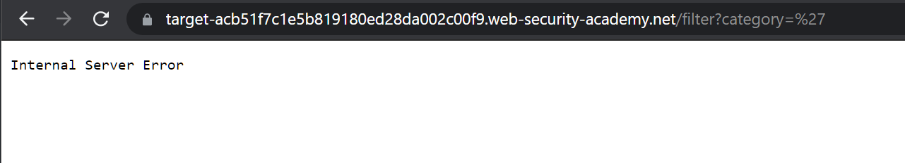
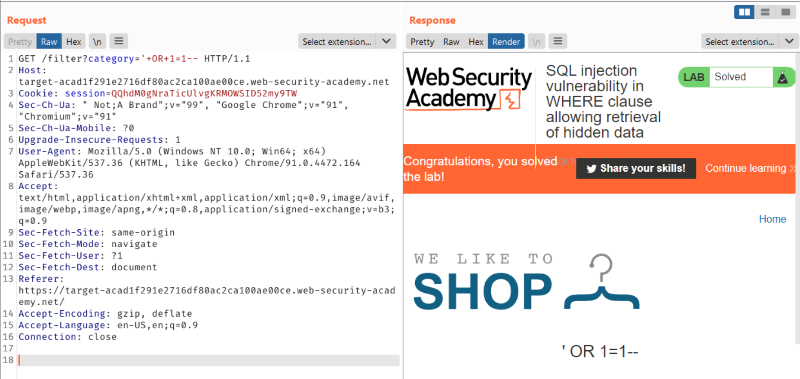

### Lab: SQL injection vulnerability in WHERE clause allowing retrieval of hidden data

#### Scenario:
This lab contains an SQL injection vulnerability in the product category filter. When the user selects a category, the application carries out an SQL query like the following:

`SELECT * FROM products WHERE category = 'Gifts' AND released = 1`

To solve the lab, perform an SQL injection attack that causes the application to display details of all products in any category, both released and unreleased.

#### Walkthrough
1. We initially land on the main page for `We like to Shop.` Due to the scenario, we can assume the vulnerable parameter will be `category.`
2. The most straightforward way to test if a target is SQL injectable is simply passing in some `bad character` like single quotes, double quotes, etc. 
3. The web application returns an `Internal Server Error` when a `'` was passed into the `category` parameter. 

4. After reviewing the following payloads (PayLoadAllTheThings)[https://github.com/swisskyrepo/PayloadsAllTheThings/tree/master/SQL%20Injection], I decided to attempt to exploit the `WHERE` clause manually. I do this in Burp Repeater since it's easy to send another request. 
5. There are two ways to go about attempting to exploit this. You can either use `Burp Repeater` or `Burp Intruder.` I opted for a slower, more manual way of exploitation with repeater. This allowed me to catch the injection as it happened. 
6. In repeater, after several attempts, the payload `+OR+1=1--` was the first injectable payload found. This injection works because the application developer did not use prepared statements when querying their SQL database. Since it was injectable, our expression `1=1--` is always going to evaluate true. 
