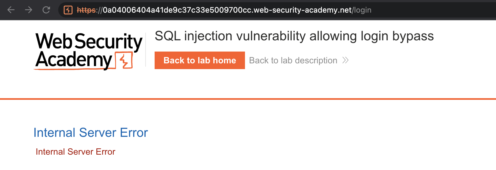
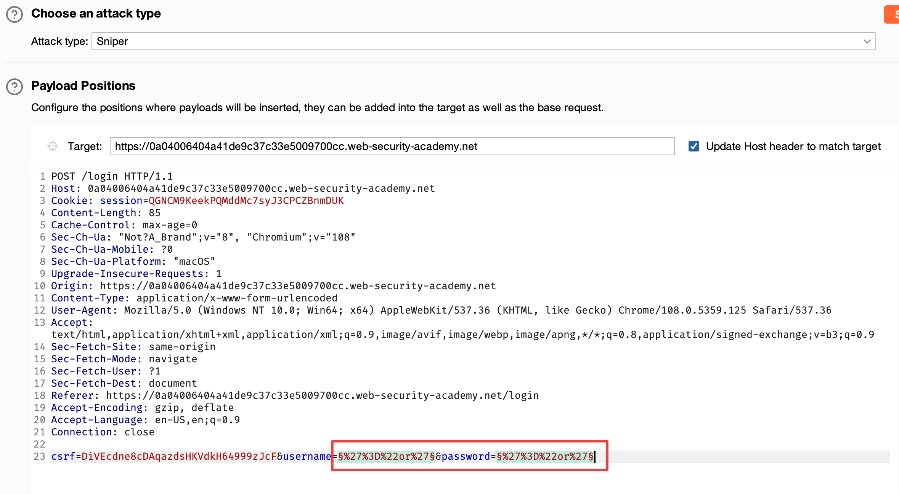
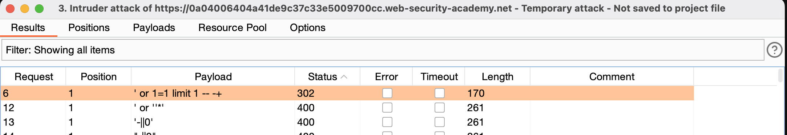
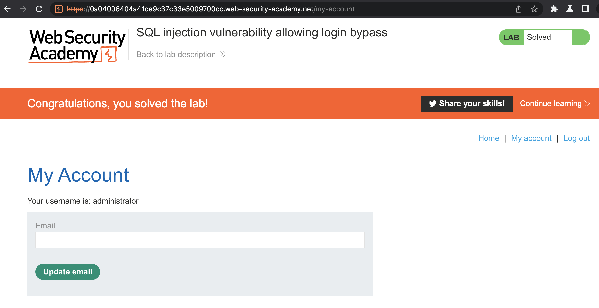

### Lab: SQL injection vulnerability allowing login bypass

#### Scenario 
This lab contains an SQL injection vulnerability in the login function.

To solve the lab, perform an SQL injection attack that logs in to the application as the administrator user.

#### Walkthrough
1. We initially land on the main page for `We like to Shop.` Due to the scenario, we can assume the vulnerable parameter will be in the `login` endpoint. 
2. Attempting a login with the payload `'1=1--` brings gives us an internal server error. 

3. After reviewing the following payload list from `Payload All The Things, ` we can test some payloads to attempt to bypass the login. 
4. Let's use Burp Intruder to solve this challenge. In many cases, we would need to account for the anti-csrf token, but the token is static for this challenge.

5. After using the payload list from `Payload All The Things` we notice that one request returns a status code `302 redirect`, and that is the payload `' or 1=1 limit 1 -- -+`

6. Placing the`' or 1=1 limit 1 -- -+` payload in the `Username` field and putting random characters in the `password` field allows us to bypass this login successfully and complete the lab. 

#### References
https://github.com/swisskyrepo/PayloadsAllTheThings/tree/master/SQL%20Injection#authentication-bypass