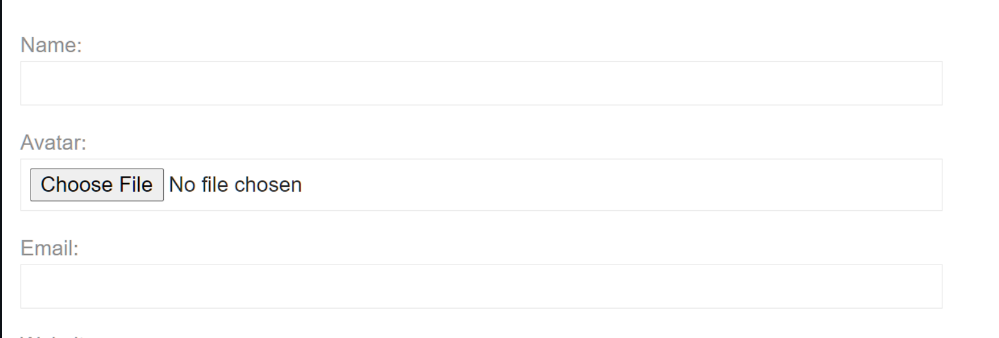

### Finding Report Example

| FR-001 | Remote Code Execution via File Upload|
|--------|--------------------------------------|
|Category: | XML External Entities |
|MITRE ATT&CK: | T1190 - Exploit Public-Facing Application|
|Testing Standard: | WSTG-INPV-07| 
|Localization: | Web Application | 
|Total Calculated Risk: | 9.6 - Critical | 

[CVSS:3.0/AV:N/AC:L/PR:N/UI:R/S:C/C:H/I:H/A:L](https://www.first.org/cvss/calculator/3.0#CVSS:3.0/AV:N/AC:L/PR:N/UI:R/S:C/C:H/I:H/A:L)

#### Details 
The `We Like to Blog` web application rendered `XML` data when implementing the commenting system's `Avatar Upload` functionality. 



This misconfiguration allowed external entities to force the XML parser on the back end of the web application to access the resource specified by the URI, e.g., a file on the local machine or a remote system. In this case, it was the world-readable file `/etc/hostname` on the underlying operating system. We used the following payload to access that file. 

```xml
<?xml version="1.0" standalone="yes"?>
<!DOCTYPE test [ <!ENTITY file SYSTEM "file:///etc/hostname" > ]>
<svg width="128px" height="128px" xmlns="http://www.w3.org/2000/svg" xmlns:xlink="http://www.w3.org/1999/xlink" version="1.1">
<text font-size="16" x="0" y="16">&file;</text></svg>
```

The web applications `avatar` upload functionality wrote the contents of the file to the image using the `<text font-size="16" x="0" y="16">&file;</text>` portion of the payload. Due to a weakly configured parser on the back end, this allowed untrusted `XML` to be run on the underlying operating system. 

#### Recommendations 
Unless it is explicitly required, external entities should be disabled at the parser level. Depending on the parser in use, the direct fix action is slightly different, but the overarching process is the same. Disabling external entities secures the parser in these types of attacks. 