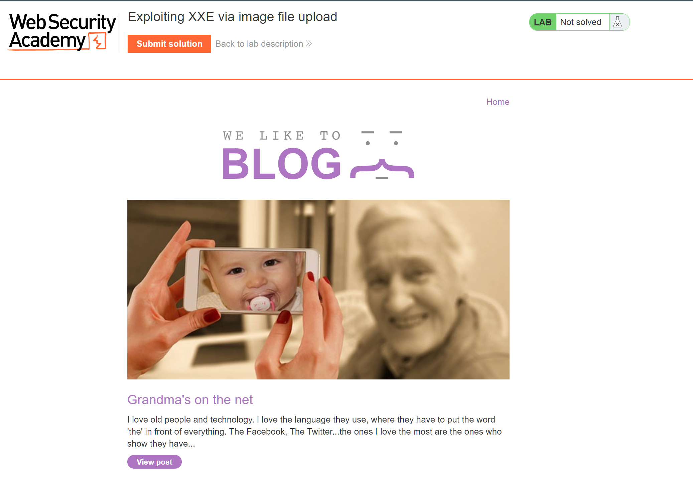
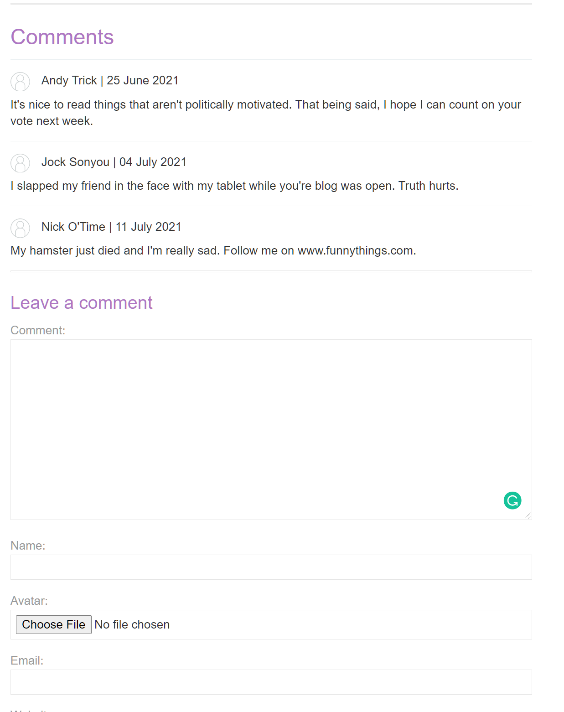
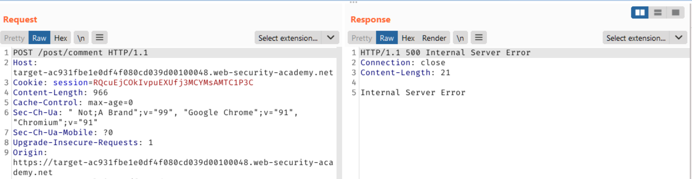

### Lab: Exploiting XXE via image file upload

#### Scenario 
This lab lets users attach avatars to comments and uses the Apache Batik library to process avatar image files. To solve the lab, upload an image that displays the/etc/hostname file contents after processing. Then use the "Submit solution" button to submit the value of the server hostname.

#### Walkthrough
1. We initially land on the login page for `We Like to Blog.` Since we already know the library and vulnerability class, we will enumerate the application until we find an image update. 

2. At the endpoint `{random_id}.web-security-academy.net/post?postId=2`, there is an avatar image upload. From the scenario of this challenge, we know the image processing library and the goal, which is to display the contents of `/etc/hostname` to verify code execution. 

3. Using the GitHub repository `PayloadsAllTheThings,` we can navigate to `https://github.com/swisskyrepo/PayloadsAllTheThings/blob/master/XXE%20Injection/Files/Classic%20XXE.xml` and review this XXE payload. 
4. Use the above payload to generate `image_payload.svg`. 
5. Attach the Payload in the `Avatar` field for the web application. 

6. This payload failed. The best way to troubleshoot a payload failure is to review the specifications for SVG/XML. Using this link, `https://www.w3.org/TR/SVG2/struct.html`, we can see the portion of the missed payload. 
7. Modify the `image_payload.svg` with the following fields. 

```xml
<?xml version="1.0" standalone="yes"?>
<!DOCTYPE test [ <!ENTITY file SYSTEM "file:///etc/hostname" > ]>
<svg width="128px" height="128px" xmlns="http://www.w3.org/2000/svg" xmlns:xlink="http://www.w3.org/1999/xlink" version="1.1">
<text font-size="16" x="0" y="16">&file;</text></svg>
```

8. Reviewing your comment shows that there's some text within your avatar. Open the file in a new tab and submit it as the flag.

Flag: `ad75814e719b`
